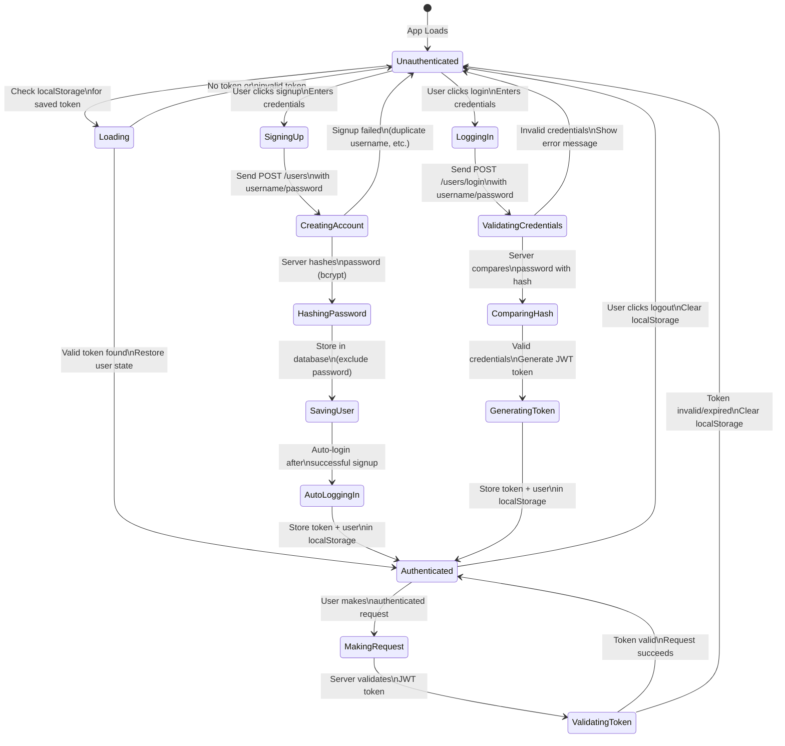
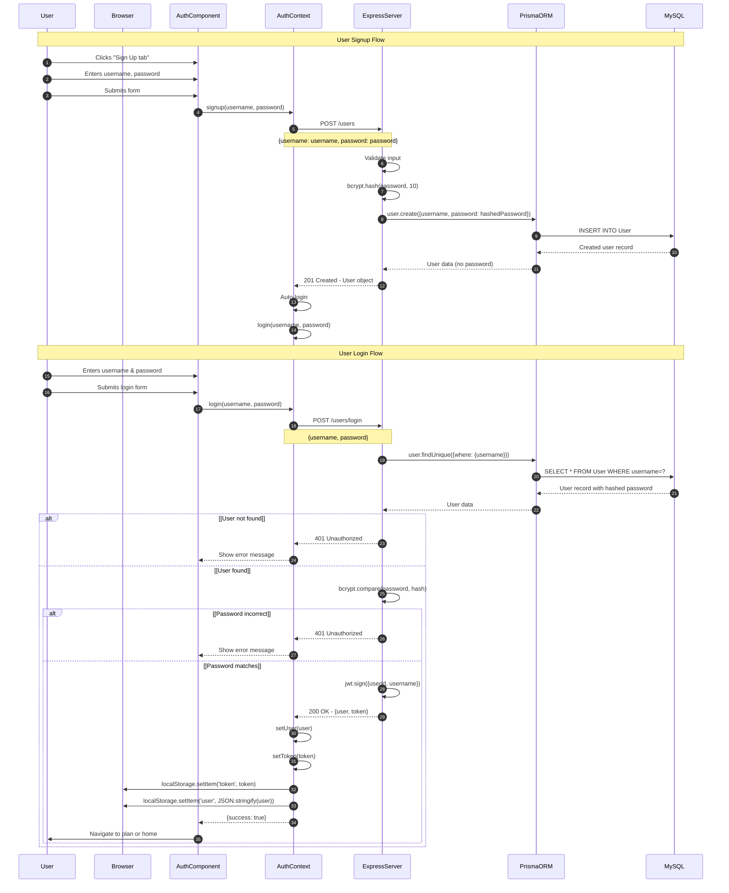

# Mermaid Diagram Code for Final Project Report

## 1. CSS Architecture Decision Flow (Design Decision 1.3)

This flowchart shows the decision-making process for where to place styles.

```mermaid
flowchart TD
    Start([Style in Component?]) --> Yes{Yes}
    Start --> No[Already in CSS file ✓]
    
    Yes --> Dynamic{Is it dynamic?<br/>depends on state/props}
    
    Dynamic -->|Yes| KeepInline[Keep inline<br/>e.g., width: `${progress}%`]
    Dynamic -->|No| MoveToCSS[Move to CSS file]
    
    MoveToCSS --> ComponentSpecific{Component-specific?}
    
    ComponentSpecific -->|Yes| ComponentCSS[ComponentName.css<br/>e.g., Header.css<br/>HomeScreen.css]
    ComponentSpecific -->|No| SharedCSS[Shared CSS file<br/>e.g., SearchBar.css<br/>Auth.css]
    
    style KeepInline fill:#90EE90
    style ComponentCSS fill:#87CEEB
    style SharedCSS fill:#87CEEB
    style No fill:#90EE90
```

## 2. Authentication Flow State Machine (Design Decision 1.4)

This state diagram shows the authentication state transitions and how the system handles login, signup, and session persistence. This directly addresses the rubric requirement for "Address security issues" (50 points).



## How to Use

1. Copy the Mermaid code above
2. Paste into any Mermaid-compatible tool:
   - https://mermaid.live/ (online editor)
   - VS Code with Mermaid extension
   - GitHub/GitLab (renders automatically in markdown)
3. Export as PNG and include in your report

## Which Diagram to Use

For the rubric requirement "Include at least one diagram to explain the alternatives clearly", I recommend using the **Authentication Flow State Machine** (Design Decision 1.4) because:
- It directly addresses the high-value rubric item "Address security issues" (50 points)
- It clearly shows the alternatives (server-side sessions vs JWT + localStorage vs memory-only)
- It demonstrates security features (password hashing, token validation)
- State diagrams are appropriate for showing authentication flows
- It directly supports the justification for choosing JWT + Context API + localStorage

The CSS Architecture flowchart is also excellent and shows code quality decisions, but the authentication state diagram better illustrates a major rubric requirement and shows the significance of the contribution.

## 3. Authentication Sequence Diagram

This sequence diagram shows the complete authentication flow including both user signup and login processes.



## 4. Complete Application Sequence Diagram

This sequence diagram shows the complete flow of the application including major search, authentication, plan saving, and loading saved plans.

```mermaid
sequenceDiagram

    autonumber

    participant User

    participant Browser

    participant SearchBar

    participant MajorService

    participant ExpressServer

    participant PrismaORM

    participant MySQL

    

    Note over User,MySQL: Major Search Flow

    User->>Browser: Opens app

    Browser->>SearchBar: Renders search input

    SearchBar->>MajorService: retrieveMajors()

    MajorService->>ExpressServer: GET /api/majors

    ExpressServer->>PrismaORM: major.findMany({select: {name: true}})

    PrismaORM->>MySQL: SELECT name FROM Major

    MySQL-->>PrismaORM: Array of major names

    PrismaORM-->>ExpressServer: Major names array

    ExpressServer-->>MajorService: JSON array

    MajorService-->>SearchBar: Major names list

    SearchBar->>SearchBar: Filter and rank suggestions locally

    User->>SearchBar: Types "Computer Science"

    SearchBar->>Browser: Display ranked suggestions

    

    Note over User,MySQL: Major Selection & Data Loading

    User->>SearchBar: Selects "Computer Science"

    SearchBar->>Browser: Navigate to /degreeplan

    Browser->>Browser: DegreePlan component mounts

    Browser->>Browser: usePlanManager hook initializes

    Browser->>Browser: useCategorizedCourses hook calls getMajorData()

    Browser->>MajorService: getMajorData("Computer Science")

    MajorService->>ExpressServer: GET /api/majors/Computer Science

    ExpressServer->>PrismaORM: major.findFirst({name})

    PrismaORM->>MySQL: SELECT id FROM Major WHERE name=?

    MySQL-->>PrismaORM: Major ID

    PrismaORM-->>ExpressServer: Major record

    ExpressServer->>PrismaORM: majorRequirement.findMany() with includes

    Note over PrismaORM: Includes: req -> requirementClasses<br/>-> class -> prereqs

    PrismaORM->>MySQL: JOIN queries (MajorRequirement, Requirement,<br/>RequirementClasses, Class, Prereq)

    MySQL-->>PrismaORM: Related data (classes, reqs, prereqs)

    PrismaORM-->>ExpressServer: Structured data

    ExpressServer->>ExpressServer: Transform to client format<br/>(uniqueClassesMap, majorRequirementsMap)

    ExpressServer-->>MajorService: {availableClasses, majorRequirements}

    MajorService-->>Browser: Major data received

    Browser->>Browser: useCategorizedCourses categorizes classes

    Browser->>Browser: useDragAndDrop initializes 16 zones

    

    Note over User,MySQL: User Authentication Flow

    User->>Browser: Clicks "Log In"

    Browser->>Browser: Auth component renders

    User->>Browser: Enters username & password

    Browser->>ExpressServer: POST /users/login

    Note over ExpressServer: {username, password}

    ExpressServer->>PrismaORM: user.findUnique({where: {username}})

    PrismaORM->>MySQL: SELECT * FROM User WHERE username=?

    MySQL-->>PrismaORM: User record with hashed password

    PrismaORM-->>ExpressServer: User data

    alt User not found

        ExpressServer-->>Browser: 401 Unauthorized

    else User found

        ExpressServer->>ExpressServer: bcrypt.compare(password, hash)

        alt Password incorrect

            ExpressServer-->>Browser: 401 Unauthorized

        else Password matches

            ExpressServer->>ExpressServer: jwt.sign({userId, username})

            ExpressServer-->>Browser: {user, token}

            Browser->>Browser: AuthContext stores token & user in localStorage

        end

    end

    

    Note over User,MySQL: Plan Saving Flow

    User->>Browser: Drags courses into quarters

    User->>Browser: Clicks "Save Plan" button

    Browser->>Browser: SavePlanPopUp opens

    User->>Browser: Enters plan name

    User->>Browser: Clicks "Save Plan" in popup

    Browser->>Browser: SavePlanPopUp calls handleSavePlan(planName)

    Browser->>Browser: usePlanManager.savePlan() serializes droppableZones

    Note over Browser: serializeDroppableZones() converts<br/>zones to quarters array

    Browser->>ExpressServer: POST /plans

    Note over Browser,ExpressServer: Authorization: Bearer <token><br/>{name, majorName, quarters}

    ExpressServer->>ExpressServer: authenticateToken middleware

    ExpressServer->>ExpressServer: jwt.verify(token)

    alt Token invalid

        ExpressServer-->>Browser: 401 or 403 Unauthorized

    else Token valid

        ExpressServer->>PrismaORM: major.findFirst({name: majorName})

        PrismaORM->>MySQL: SELECT id FROM Major WHERE name=?

        MySQL-->>PrismaORM: Major ID

        PrismaORM-->>ExpressServer: Major record

        ExpressServer->>PrismaORM: plan.create() with nested data

        Note over PrismaORM: Creates Plan, then Quarters,<br/>then PlanClasses in transaction

        PrismaORM->>MySQL: INSERT INTO Plan...

        PrismaORM->>MySQL: INSERT INTO Quarter...

        PrismaORM->>MySQL: INSERT INTO PlanClass...

        MySQL-->>PrismaORM: Created records

        PrismaORM-->>ExpressServer: Plan with relations

        ExpressServer-->>Browser: 201 Created - Plan saved

        Browser->>Browser: SavePlanPopUp closes

    end

    

    Note over User,MySQL: Loading Saved Plans

    User->>Browser: Clicks "Browse Saved Plans"

    Browser->>Browser: SavedPlansButton calls getPlans()

    Browser->>ExpressServer: GET /plans

    Note over Browser,ExpressServer: Authorization: Bearer <token>

    ExpressServer->>ExpressServer: authenticateToken middleware

    ExpressServer->>PrismaORM: plan.findMany({where: {userId}})

    Note over PrismaORM: Includes: major, quarters with<br/>planClasses and class data

    PrismaORM->>MySQL: SELECT with JOINs (Plan, Major, Quarter,<br/>PlanClass, Class) WHERE userId=?

    MySQL-->>PrismaORM: User's plans with all relations

    PrismaORM-->>ExpressServer: Plans array

    ExpressServer-->>Browser: JSON array of plans

    Browser->>Browser: SavedPlansButton sets savedPlans state

    Browser->>Browser: PlansPopUp displays plans

    User->>Browser: Clicks on a plan

    Browser->>Browser: PlansPopUp calls handleLoadScreen(plan)

    Browser->>Browser: usePlanManager.loadPlan() deserializes plan

    Note over Browser: deserializePlanToZones() converts<br/>quarters back to zone structure

    Browser->>Browser: Updates droppableZones state

    Browser->>Browser: Removes loaded courses from categorizedClasses
```



